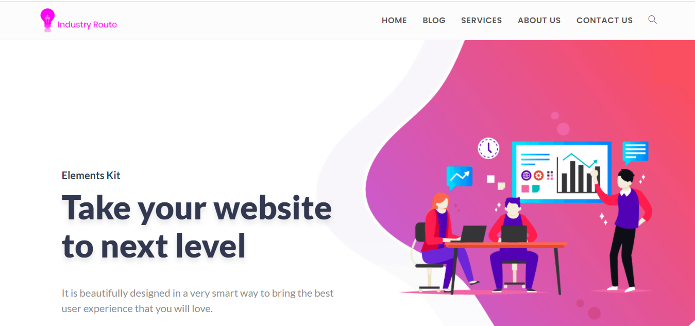

Industry Route is a showcase web site is a website used to present the products and services offered by a company or small business to the customer, reinforcing the perception of the brand.

This website contains 4 sections : 
 - Services
 - Blog
 - Contact
 - About Us

## Table of contents
* [Documentation](#documentation)
* [Demo](#demo)
* [Screenshots](#screenshots)
* [Technologies](#technologies)
* [Setup](#setup)
* [Features](#features)
* [Status](#status)
* [Contact](#contact)
* [License](#license)

## Documentation
Please read the [documentation](https://github.com/aniskchaou/INDUSTRY-ROUTE-CMS/wiki) page for more details.

## Demo
http://industryroute.byethost9.com/

## Screenshots

## Technologies
* Wordpress - version 5.6
* OceanWP
* Elementor

## Setup

## Features
 - 100% Responsive
 - Contrasting Colour Scheme
 - Well Planned Information Architecture
 - Fast Load Times
 - Effective Navigation
 - Usable Forms

## Status
Project is: _finished_

## Contact
contact@delta-dev-software.com

## License
<a href="license.txt">MIT License</a>